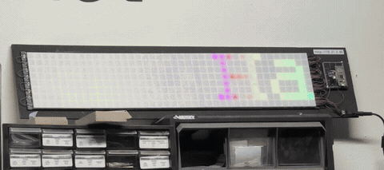

# litebrite



## Hardware

- **Board**: Raspberry Pi Pico 2W (RP2350, Wi-Fi/BLE capable)
- **Display**: 40x8 WS2812B (NeoPixel) LED matrix (320 LEDs total)
- **Data pin**: GP20
- **Wiring**: Serpentine layout — even rows run right-to-left, odd rows left-to-right
- **Coordinate system**: x=0 is left, y=0 is bottom

## Firmware

The board runs **MicroPython**. All code must be compatible with MicroPython (not CPython).

Key differences from CPython:
- Use `machine.Pin`, `neopixel.NeoPixel`, `time.sleep_ms()` etc.
- No `pip` — only built-in modules and files copied to the board
- Limited RAM — keep data structures small and avoid large allocations

## Deploying Code

### deploy.sh

```bash
./deploy.sh
```

Copies all runtime files to the board and resets it in a single mpremote session.

### mpremote

```bash
# Install mpremote on your host machine
pip install mpremote

# Open a REPL session
mpremote repl
```

### Flashing MicroPython firmware

1. Hold BOOTSEL while plugging in the Pico — it mounts as a USB drive
2. Download the MicroPython `.uf2` for **Pico 2W** from https://micropython.org/download/RPI_PICO2_W/
3. Drag the `.uf2` onto the mounted drive — board reboots into MicroPython
